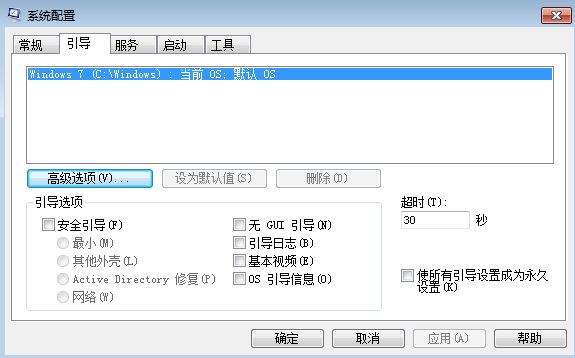
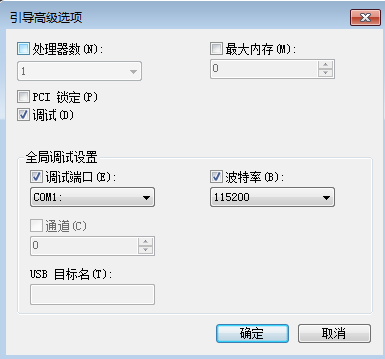

Source: [Moeomu's blog](/posts/windows-kernel-debugging-learning-notes-001-environment-building/)

## Download Tools

- Windows 7 SP1 x86 [mirror Xunlei download link](thunder://QUFlZDJrOi8vfGZpbGV8Y25fd2luZG93c183X3VsdGltYXRlX3dpdGhfc3AxX3g4Nl9kdmRfdV82Nzc0ODYuaXNvfDI2NTMyNzYxNjB8NzUwM0U0QjlCODczOERGQ0I5NTg3MjQ0NUM3MkFFRkJ8L1pa)
- VMWare Workstation 16 (link below)
- WinDbg Preview([Microsoft Store](https://www.microsoft.com/zh-cn/p/windbg-preview/9pgjgd53tn86))

---

## Install Windows Virtual Machine

> Initially use Windows 7 SP1 x86 as an example to learn

- MSDN download the official image
- VMWare Workstation 16 to build a virtual environment
  - Download: [VMWare 16 Link](https://www.vmware.com/go/getworkstation-win)
  - Key: `ZF3R0-FHED2-M80TY-8QYGC-NPKYF`

---

## Configure the Windows kernel debug virtual machine

### Remove the printer device from this virtual machine

### Add serial serial port

- Click Use named pipe
- Fill in the string: `\\.\pipe\Windows7x86` (you can fill in the pipeline naming you wish, but you can only modify the `Windows7x86` location)
- Below select that end is the server and the other end is the application
- In I/O mode, select `Active abort when polling`

> The configuration is completed as shown below

### Configure Windows 7

- Enter the command `msconfig` and click boot as shown below

  
- Click on advanced options, enable debugging, baud rate, as shown

---

## Configure WinDbg Preview

- First start the proxy network for unlocking GFW restrictions
- Set up WinDbg's symbol server and local cache directory `SRV*D:\LocalSymbols*http://msdl.microsoft.com/download/symbols`
- Attach to kernel-COM-check all the checkboxes you can-fill the baud rate-fill the port with `\\.\pipe\Windows7x86`
- Click OK to debug the virtual machine kernel
- Set WinDbg's symbol server proxy `set _NT_SYMBOL_PROXY=proxy server address:port number`
