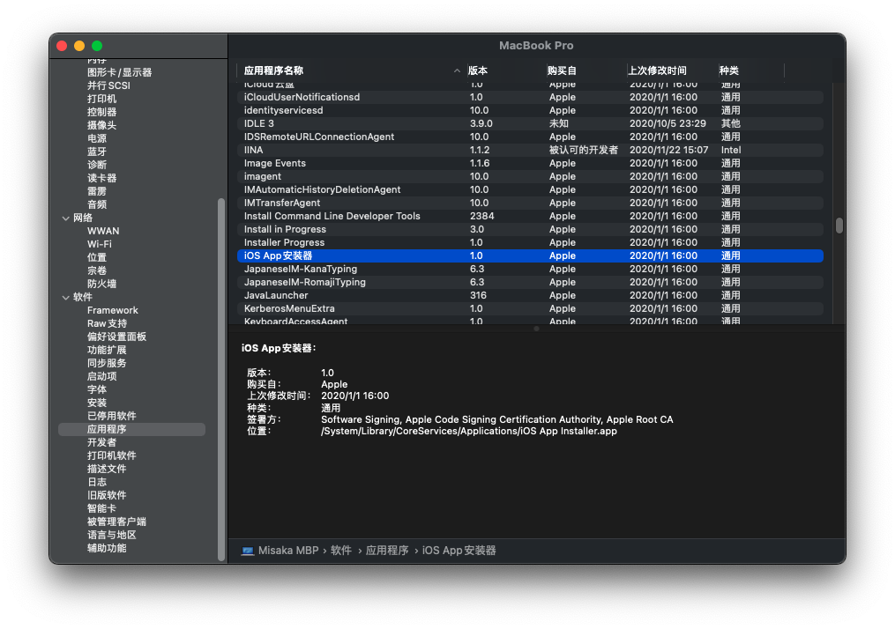
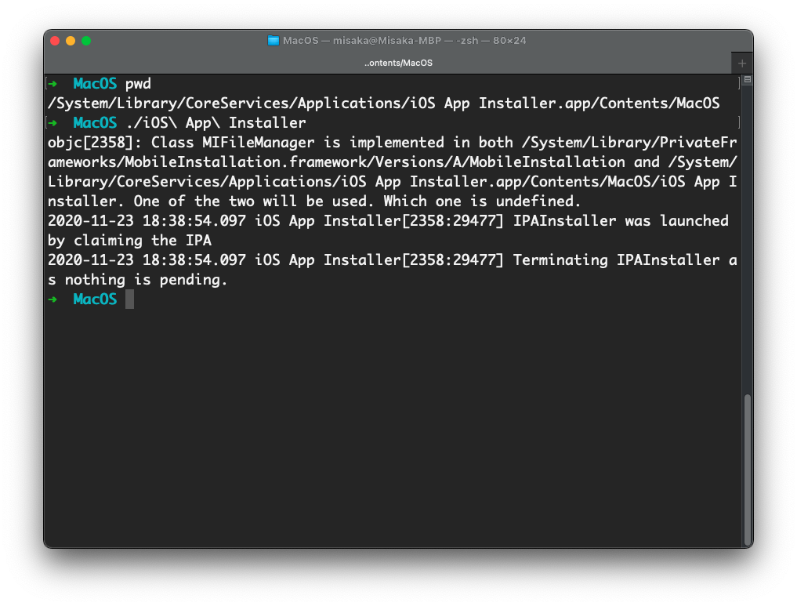
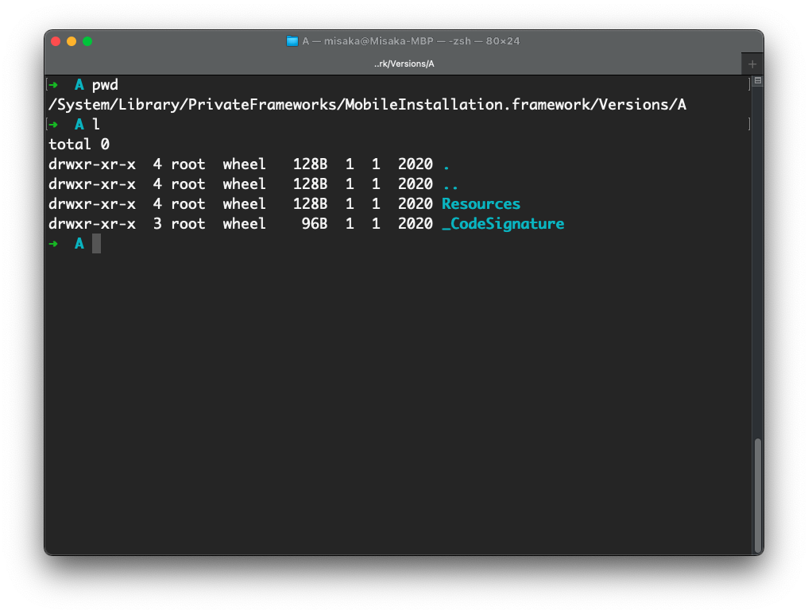
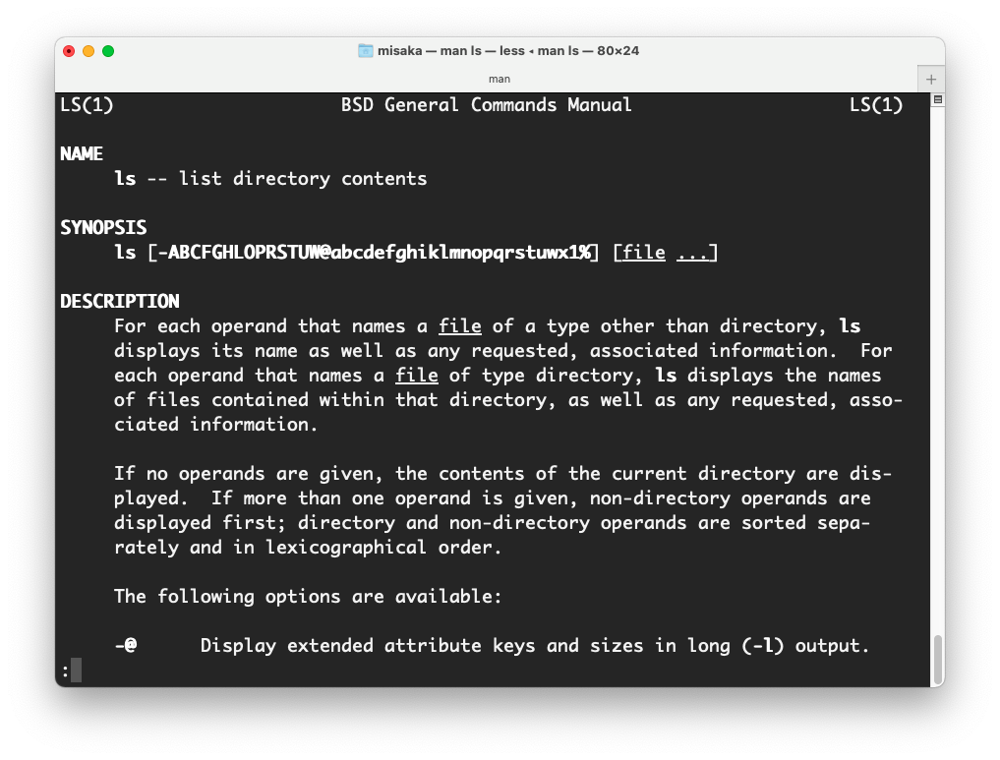

本文来源：[Moeomu的博客](/zh-cn/posts/macos-pkg文件逆向解析/)

## 起因

ed2k链接没法用motrix下载，准备去下载一个迅雷的精简版，突然发现找出来的是pkg安装包，引起了我的兴趣

## 经过

### 解包

- 一直以来都很奇怪pkg究竟运行了哪些东西，又干了什么，因此开始第一步，解包
- 解包只需要一条命令即可：`pkgutil --expand 需要解包的pkg.pkg 自定义解包文件夹名`

### 查看

- 发现有个Res文件，没有后缀，用file查看一下格式发现它被压缩了，索性unar指令解压，出来一个同名文件，但是大小变大了
- 在finder中右键-打开方式-归档实用工具-app被直接解压出来
- 将此app拖入/Application中，发现可以直接使用，就此完成任务
- 看了看其它文件，有个用于打开网页的Unix可执行文件，大概就是推广，没有流氓行为

## 结果

- 完成任务

## 追加

### iOS app 安装器的探索

- 更新了BigSur系统后，发现系统中存在`iOS app 安装器`这么个东西，但是无法运行，遂探索了一番


- 查看此软件位置，顺便看看种类，很好，通用，意味着可能以后会支持Intel？



- 打开Terminal，进入此文件夹，运行软件，报错，提示需要依赖文件，如图



- 找到依赖文件所在位置，发现貌似没有东西，原因可能是仅提供ARM版本的依赖程序



### Parallels Desktop 无法联网解决办法

- 依旧是BigSur的问题，PD16又不能联网了，无奈找了个折中的解决办法
- 运行命令`sudo -b /Applications/Parallels\ Desktop.app/Contents/MacOS/prl_client_app`后将会打开PD16，这样就能联网了
- 这条命令的意思是将此程序以管理员权限运行，但是其实应该是BigSur再次收紧了权限，导致PD16破解出问题
- 可以将这条命令写入.command文件中放在桌面，这样双击打开也可

### ls -l的@符号问题

- 最近发现有的文件夹/文件会出现@符号的标识，有些奇怪这是什么意思，就简单探究了一下
- 由于此现象是ls程序出现的，因此问问系统的说明文档，命令`man ls`
- 很快啊，啪的一下就出来了，如图



```s
-@      在long(-l)输出中显示扩展的属性键和大小。
```

- 非常明了了，就是指的是这种文件/文件夹存在扩展属性，而此属性可以使用`xattr -l`命令查看
- 这种属性也可以使用`xattr -c`完全清理掉
