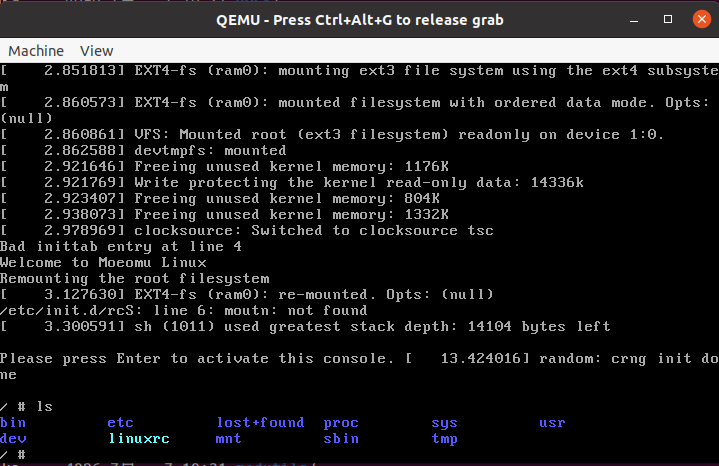

Source: [Moeomu's Blog](/posts/linux-kernel-programming-study-notes-001-compiling-and-booting-kernel/)

## Prepare the environment

- Ubuntu 20.04 LTS
- Linux 4.9.229
- Busybox 1.33.0
- qemu

### Download kernel source code and file system source code

- Download `linux-4.9.229.tar.gz` at the site [Kernel.org](https://www.kernel.org).
- Download `busybox-1.33.0.tar.bz2` from the site [Busybox.net](https://www.busybox.net/downloads).
- Install qemu via apt: `sudo apt install qemu-system-x86`.

## Compilation

### Compiling the kernel

- `export ARCH=x86`。
- `make x86_64_defconfig`。
- `make menuconfig`。
  - Check `General Settings -> Initial RAM file system and RAM disk (initramfs/initrd) support`.
  - Check `Device Driver -> Block Devices -> RAM Block Device Support`.
  - Modify `Device Driver -> Block Devices -> RAM Block Device Support -> (65536) default RAM disk size (kbytes)`.

> If this step reports a `fatal error: curses.h`, then install `sudo apt install libncurses5-dev`.

- The compiled kernel is placed in the

- The compiled kernel is placed in the directory `arch/x86/boot` under the file name `bzImage`.

### Compile busybox

- Compile busybox
  - Check "Settings -> Build Options -> [*] Build Busybox as a static binary (no fragmented libraries)".
- `make && make install`。

## Packaged file system

- `mkdir etc dev mnt`。
- `mkdir -p proc sys tmp`。
- `mkdir -p etc/init.d`。
- `vim etc/fstab`。
  
  ```text
  proc /proc proc defaults 0 0
  tmpfs /tmp tmpfs defaults 0 0
  sysfs /sys sysfs defaults 0 0
  ```

- `vim etc/init.d/rcS`

  ```shell
  echo -e "Welcome to Moeomu Linux"
  /bin/mount -a
  echo -e "Remounting the root filesystem"
  mount -o remount rw /
  mkdir -p /dev/pts
  moutn -t devpts devpts /dev/pts
  echo /sbin/mdev > /proc/sys/kernel/hotplug
  mdev -s
  ```

- `chmod 755 etc/init.d/rcS`
- `vim etc/inittab`
  
  ```text
  ::sysinit:/etc/init.d/rcS
  ::respawn:-/bin/sh
  ::askfirst:-/bin/sh
  ::cttlaltdel:/bin/umount -a -r
  ```

- `chmod 755 etc/inittab`
- `cd dev`
- `sudo mknod console c 5 1`
- `sudo mknod null c 1 3`
- `sudo mknod tty1 c 4 1`

- The following code is executed line by line in the busybox source code directory
  
  ```shell
  #!/bin/bash
  rm -rf rootfs.ext3
  sudo rm -rf fs
  dd if=/dev/zero of=./rootfs.ext3 bs=1M count=32
  mkfs.ext3 rootfs.ext3
  mkdir fs
  sudo mount -o loop rootfs.ext3 ./fs
  sudo cp -rf ./_install/* ./fs
  sudo umount ./fs
  gzip --best -c rootfs.ext3 > rootfs.img.gz

  ```

- The final filesystem is generated: `rootfs.img.gz`

## Running the system with QEMU

- `qemu-system-x86_64 -kernel ./linux-4.9.229/arch/x86_64/boot/bzImage -initrd ./busybox-1.33.1/rootfs.img.gz -append "root=/dev/ram init=/linuxrc" -serial file:output.txt`

- Previews are as follows

  
